# 👋 Welcome to the Budgettt Team!

First off, **thank you** for considering contributing to Budgettt! We believe that open source is a place for everyone, whether you're a coding wizard or writing your very first line of JavaScript.

This guide is designed to help you understand how this app works and how to get it running on your machine in **less than 5 minutes**.

---

## 🏗️ The Big Picture

Budgettt is a **Personal Finance Dashboard** that looks premium but is built with simple, standard technologies. Here is how the pieces fit together:

```mermaid
graph TD
    User[👤 You / User] -->|Visits Website| Frontend[⚛️ React Frontend]
    Frontend -->|Stores Data Offline| IDB[(🗄️ IndexedDB)]
    Frontend -->|Syncs Data| Backend[🚀 Vercel Backend]
    Backend -->|Authenticates| Firebase[🔥 Firebase Auth]
    Backend -->|Persists Data| Firestore[(☁️ Cloud Firestore)]
```



### The Three Pillars
1.  **The Client (`/`)**: This is the React app the user sees. It handles all the UI, charts, and logic. It uses **Vite** to be super fast.
2.  **The API (`/api`)**: This is our backend server. It runs on **Node.js** and handles secure things like talking to the cloud database.
3.  **The Core (`/src/core`)**: These are helper files (like math for money, or syncing logic) that are shared across the app.

---

## 🚀 Quick Start Guide

Ready to code? Follow these simple steps.

### 1. Prerequisities
Make sure you have these installed:
- [Node.js](https://nodejs.org/) (Version 18 or higher)
- [Git](https://git-scm.com/)

### 2. Get the Code
Open your terminal (Command Prompt, PowerShell, or Terminal) and run:

```bash
git clone https://github.com/TarunyaProgrammer/Student-expense-tracker.git
cd Student-expense-tracker
```

### 3. Install Dimensions
We need to download the tools (dependencies) the app needs.

```bash
# Install dependencies for the Frontend
npm install

# Install dependencies for the Backend
cd api
npm install
cd ..
```

### 4. Run the App! 🏃‍♂️
To start the development server:

```bash
npm run dev
```

You should see a message saying the app is running at `http://localhost:5173`. Open that link in your browser!

> **Note:** The backend feature (Sync & AI) requires a special key file (`service-account.json`). If you don't have it, don't worry! The app works perfectly in **Offline Mode**.

---

## 📂 Project Tour

Here is where everything lives. We keep it organized!

### `src/` (The Brains)
- **`components/`**: The Lego blocks of the app.
    - `Dashboard.jsx`: The main screen with charts and balance.
    - `TransactionList.jsx`: The list of your spending.
    - `AddTransactionModal.jsx`: The pop-up form to add money.
- **`hooks/`**: Special functions that give superpowers to components.
    - `useTransactions.js`: Handles adding/deleting money logic.
    - `useAuth.js`: Handles login/logout logic.
- **`core/`**: The "Engine Room".
    - `money.js`: Math helpers (formatting Rupees).
    - `sync.js`: The magic code that saves data to the cloud.

### `api/` (The Server)
- **`index.js`**: The main entry point for the backend. It tells the server how to handle requests like `/api/sync`.

---

## 🤝 How to Contribute

1.  **Find a bug or idea?** Open an Issue on GitHub.
2.  **Ready to fix?** Fork the repo, make your changes, and open a Pull Request (PR).
3.  **Be kind!** We value kindness and learning over "perfect code".

Happy Coding! 💜
